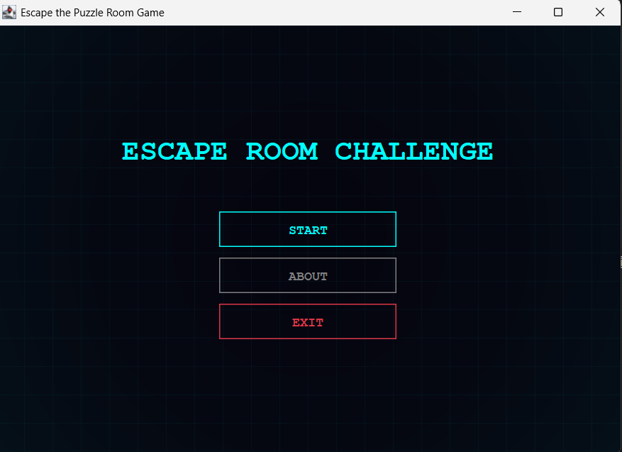
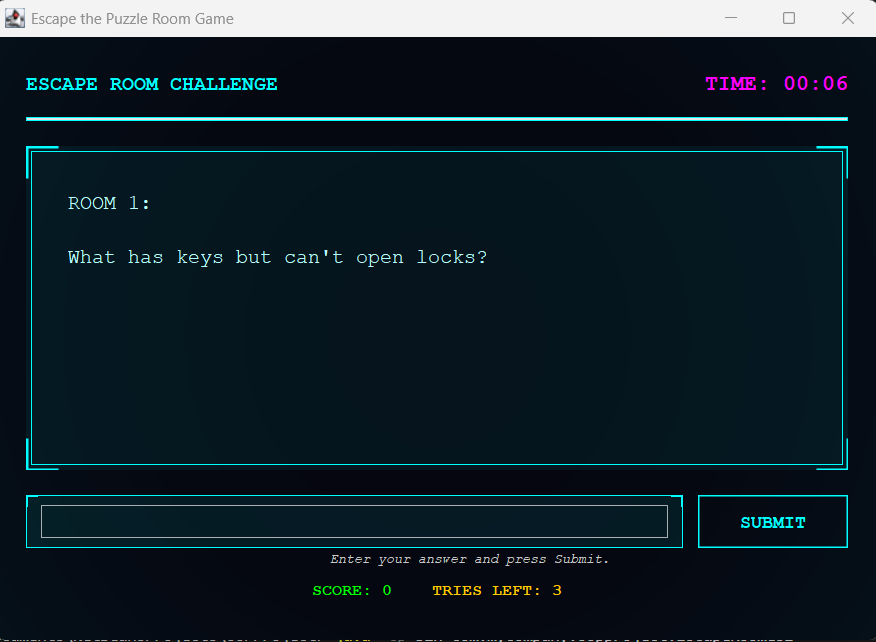

# Escape Room: System Breach 🧠🔐

A high-tech, Sci-Fi themed Java application where you must solve riddles to bypass security layers and escape the system. This project demonstrates advanced Swing custom painting, audio integration, and clean Object-Oriented Programming (OOP) principles.

## 🌌 Sci-Fi HUD Interface
The game features a completely custom-painted "System Breach" interface with:
- **Neon HUD Aesthetic**: Cyan and Magenta accents on a deep void background.
*   **Typewriter Effect**: Questions reveal character-by-character for a terminal-hacker feel.
*   **Animated HUD**: Hover-glow buttons with scanner line effects and decorative corner brackets.
*   **Progress Tracking**: Integrated mission progress bar and real-time timer.

## 🔊 Audio Feedback System
The experience is synchronized with high-quality audio triggers:
- **Access Granted**: Plays when a riddle is solved correctly.
- **Access Denied**: Plays on incorrect attempts or system lockout.
- **Victory Chime**: Plays upon successful completion of all security layers.

## 🖼️ Interface Screenshots
*(Save your screenshots as `screenshot1.png` and `screenshot2.png` in the root folder to see them here)*




## 🛠️ Project Structure
- `EscapeRoomGUI.java`: The Frontend—handles the custom-painted HUD, animations, and audio playback.
- `EscapeGame.java`: The Backend engine—manages the game state, encryption keys, and room progression.
- `Room.java`: The Data Model—defines the structure of a puzzle room and verification logic.

## 🚀 How to Run
### Prerequisites
- Windows OS (required for PowerShell-based MP3 audio support).
- Java Development Kit (JDK) 8 or higher.

### Compile and Run
1. Open your terminal in the project root.
2. Compile the project:
   ```bash
   javac -d bin src/main/java/com/mycompany/oopproject/*.java
   ```
3. Run the application:
   ```bash
   java -cp bin com.mycompany.oopproject.EscapeRoomGUI
   ```
